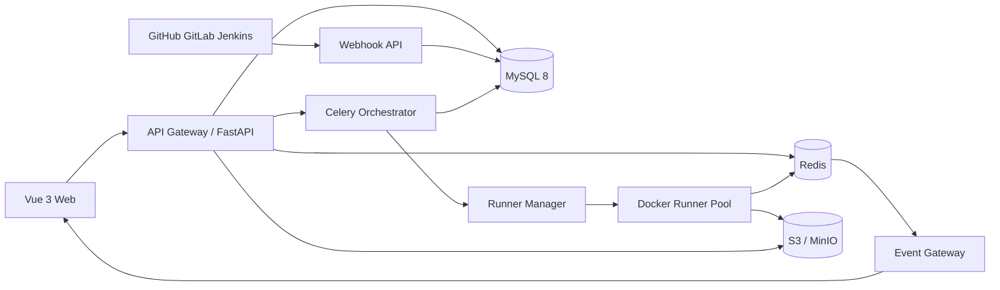

# 智能测试平台总体设计

## 1. 产品定位

平台服务于测试负责人、测试工程师、自动化工程师、开发人员和产品人员，统一管理测试资产、执行基础设施与质量数据。平台不替代 Git、CI 或完整研发项目管理系统，而是通过集成形成质量闭环。

### 1.1 核心目标

1. 统一测试资产：需求、用例、脚本、数据、计划、执行、缺陷和报告。
2. 提升自动化效率：声明式接口测试、pytest 脚本和 Playwright UI 测试统一运行。
3. AI 辅助而非替代评审：AI 生成内容必须可解释、可追踪并经人工采纳。
4. 执行安全可靠：控制面与执行面隔离，任务可取消、重试、限流和审计。
5. 质量可度量：按需求覆盖、执行结果、缺陷和趋势提供可信指标。

### 1.2 角色

| 角色 | 主要职责 |
|---|---|
| 平台管理员 | 租户、系统角色、Runner 集群、全局集成与审计 |
| 项目管理员 | 项目成员、环境、权限、配额和集成配置 |
| 测试负责人 | 测试策略、计划审批、质量门禁和报告发布 |
| 测试工程师 | 需求分析、用例设计、手工执行、缺陷验证 |
| 自动化工程师 | 脚本、公共组件、数据集和 Runner 镜像维护 |
| 开发人员 | 查看失败证据、处理缺陷、触发回归 |
| 产品/业务人员 | 查看覆盖、验收结果和质量风险 |
| 审计员 | 只读查看安全与操作审计 |

## 2. 产品信息架构

| 模块 | 核心能力 |
|---|---|
| 工作台 | 我的任务、风险、计划进度、最近失败、待评审项 |
| 项目管理 | 项目、迭代、版本、成员、环境、变量、通知、配额 |
| 需求管理 | 创建/导入/同步、验收标准、状态、覆盖分析、追溯视图 |
| 测试用例 | 树形用例库、步骤、参数、标签、版本、评审、导入导出 |
| AI 测试设计 | 需求解析、生成正向/异常/边界用例、去重、评分、采纳 |
| 自动化中心 | 接口场景、pytest/Playwright 脚本、公共组件、调试、版本 |
| 测试计划 | 范围、人员、环境、用例集、执行策略、准入/退出条件 |
| 执行中心 | 手工/自动执行、实时日志、进度、证据、取消、重跑 |
| 定时任务 | Cron/一次性调度、时区、并发策略、重试、通知 |
| 缺陷管理 | 创建、流转、同步、证据、关联失败、修复验证 |
| 测试报告 | 计划报告、趋势、覆盖率、自动化率、缺陷分布、导出 |
| 追溯矩阵 | 需求—用例—脚本—执行—缺陷的正反向影响分析 |
| 系统管理 | 角色、策略、密钥、审计、Runner、镜像和集成 |

## 3. 核心业务闭环

### 3.1 主流程

1. 导入或创建需求，填写验收标准并归属迭代。
2. 人工设计或由 AI 生成候选用例，评审后发布用例版本。
3. 用例绑定声明式接口场景、pytest 或 Playwright 脚本版本。
4. 测试计划冻结需求、用例、脚本、环境与数据集版本。
5. 手工、定时或 CI 事件触发执行，独立 Runner 实时回传事件。
6. 失败记录一键创建缺陷，自动附带环境、日志、截图和 trace。
7. 修复提交触发关联用例回归；结果写入新的执行记录。
8. 发布不可变报告快照，并由质量门禁向 CI 返回状态。

### 3.2 追溯关系

- 需求与用例为多对多关系，并记录覆盖类型与关联来源。
- 一个用例可绑定多个自动化脚本，但同一引擎只能指定一个当前生效版本。
- 计划项冻结 `case_revision_id`、`script_revision_id`、`environment_revision_id`。
- 每次重试产生新 attempt，不覆盖原失败证据。
- 缺陷可关联多条失败和回归记录，保留首次发现与最近验证关系。
- 关联关系使用稳定 ID，不使用名称推断；所有变更进入审计。

## 4. 自动化测试模型

### 4.1 三类执行方式

| 引擎 | 用途 | 实现方式 |
|---|---|---|
| HTTP | 低代码接口场景 | 基于 requests 的平台适配器执行步骤、提取与断言 |
| pytest | 代码型接口/集成测试 | pytest 插件采集 case、阶段、断言和附件事件 |
| Playwright | Web UI 自动化 | Python Playwright，采集 screenshot、trace、video |

### 4.2 配置与变量

参数覆盖优先级为：平台默认 < 项目公共参数 < 环境 < 测试套件 < 用例 < 数据行。变量分为普通变量与秘密引用，秘密永不进入任务消息、日志和报告。

作用域分为 `run`、`suite`、`case`、`step`。并行用例不得共享可变变量；跨用例依赖必须显式建模为 DAG。接口关联可从 JSONPath、响应头、Cookie 或正则提取，并写入后续步骤作用域。

### 4.3 前置后置处理

- 生命周期：`before_run`、`before_suite`、`before_case`、`before_step` 及对应 after/finally。
- 支持声明式数据库准备、HTTP 调用和版本化 Python hook。
- after/finally 在失败和软取消时尽力执行，并设置独立超时。
- Hook 输出必须经过结构化校验和秘密脱敏。

### 4.4 数据驱动、断言与重试

- 数据集支持 CSV/JSON/表格录入、版本、脱敏列、行筛选和组合策略。
- 内置状态码、Header、JSONPath、JSON Schema、正则、响应时间、页面元素断言。
- 业务失败重试与基础设施重试分离；每次重试生成独立 attempt。
- 非幂等 HTTP 请求默认不自动重试，必须显式允许并配置幂等键。
- 并发受租户、项目、计划、Runner 资源四级配额约束。

### 4.5 脚本管理

- 脚本来源支持平台上传包和 Git 仓库路径，保存 commit SHA 与内容摘要。
- 发布后 revision 不可修改；回滚只是切换生效指针。
- 解包前规范化所有路径并拒绝绝对路径、`../`、symlink、hardlink、设备文件及超出文件数/解压比配额的压缩包。
- 锁定依赖名称、版本和 hash，执行 SCA/恶意文件扫描；Runner 禁止在线安装未审批依赖。
- Python 脚本与 Hook 执行 AST/危险调用扫描并标记风险；因测试代码本质上可执行任意逻辑，容器、网络和最小凭据才是最终安全边界。
- 校验入口路径、包大小、文件类型、依赖白名单和 Runner 镜像能力。
- 禁止使用可变 `latest` 镜像；任务固定脚本摘要和镜像 digest。

## 5. AI 生成用例

### 5.1 输入与输出

输入包括需求正文、验收标准、业务规则、历史用例、接口定义和项目术语。输出为结构化候选用例：标题、前置条件、步骤、预期、优先级、测试类型、覆盖点和生成依据。

### 5.2 处理链路

1. 对输入做权限检查、敏感信息脱敏和内容分块。
2. 检索同项目已授权知识，禁止跨租户召回。
3. 按正向、异常、边界、权限、安全、兼容性维度生成。
4. 使用结构化 Schema 校验、相似度去重和规则评分。
5. 候选项进入草稿区，展示来源、覆盖点与风险提示。
6. 人工编辑、采纳或拒绝；只有评审通过的用例进入正式库。

记录模型提供者、模型版本、提示词模板版本、输入文档摘要、输出和采纳结果，用于审计和效果评估。不得把项目数据用于未授权的外部模型训练。

## 6. 总体技术架构



### 6.1 架构原则

- **控制面**：Vue、FastAPI、MySQL、Celery 负责编排和治理，不运行用户代码。
- **执行面**：Runner Manager 精确创建/停止一次性 Docker Runner。
- **事实源**：MySQL 保存业务和终态；Redis 数据允许过期或重建。
- **制品面**：S3/MinIO 保存脚本包、日志分片、截图、trace、video、报告。
- **演进方式**：MVP 采用模块化单体，Runner Manager 和 Runner 从首期独立部署。

## 7. 前端设计

技术建议：Vue 3、TypeScript、Vite、Pinia、Vue Router、Element Plus、ECharts、Monaco Editor。

按领域拆分 `requirements`、`cases`、`automation`、`plans`、`executions`、`defects`、`reports`、`admin` 模块。请求层统一处理项目上下文、错误码、乐观锁和权限指令；按钮隐藏只用于体验，授权必须由后端再次校验。

执行详情页采用虚拟列表承载日志，通过 SSE 按序号续传；顶部显示总进度、当前阶段、Runner、耗时和取消按钮，右侧按用例展示截图、错误堆栈、网络 trace 与附件。

## 8. 后端模块

| 模块 | 职责 |
|---|---|
| identity | 用户、组织、登录、服务账号 |
| authorization | RBAC、项目范围、数据策略、操作授权 |
| project | 项目、迭代、版本、成员、环境 |
| requirement | 需求及外部同步 |
| testcase | 用例、步骤、版本、评审 |
| ai_design | 提示词、生成任务、候选项、反馈 |
| automation | 脚本、接口场景、数据集、变量、Hook |
| testplan | 计划、计划项、质量门禁 |
| execution | Run/Attempt/CaseResult、编排、取消 |
| scheduler | Cron、并发策略、补偿触发 |
| defect | 缺陷、流转、外部同步、回归 |
| report | 聚合、快照、导出 |
| integration | GitHub/GitLab/Jenkins webhook 与状态回写 |
| audit | 审计 outbox、查询与归档 |

FastAPI 使用分层结构：API Schema → Application Service → Domain → Repository。禁止 API 层直接拼接 Celery 任务或跨模块写表；跨模块事件通过事务 Outbox 发布。

## 9. Runner 与任务协议

### 9.1 组件边界

- FastAPI 校验请求并生成不可变 RunSpec。
- Celery Orchestrator 处理展开、分片、配额、租约、超时、聚合和报告。
- 只有 Runner Manager 可以访问 Docker API；FastAPI/Celery 不挂载 Docker Socket。
- Runner Agent 下载只读快照，选择 HTTP、pytest 或 Playwright Adapter 执行。

### 9.2 TaskEnvelope

任务只包含 ID、版本和短期引用，至少包括：

- `protocol_version`、`tenant_id`、`project_id`、`run_id`、`attempt_id`。
- 幂等键、创建时间、deadline、trace context。
- 脚本 revision/digest、环境 revision、数据集 digest、Runner 镜像 digest。
- engine、入口、selector、shard、worker 数、超时、资源和重试策略。
- 普通参数及 `secret_ref`；不包含秘密明文。

### 9.3 实时事件

事件包含 `run_id`、`attempt_id`、`case_id`、`step_id`、单调递增 `seq`、时间和类型。类型包括 started、progress、log、assertion、screenshot、error、heartbeat、artifact、finished。

Runner 将事件写入本地 append-only spool，同时按序发送 Redis Stream；日志按 NDJSON 分片持续上传对象存储，断言、状态和 artifact 索引幂等写入 MySQL。只有持久层确认到指定 seq 后，Runner 才可清理本地 spool。

Event Gateway 通过 SSE 推送 Redis 中的低延迟事件；客户端携带 `Last-Event-ID` 重连。Redis 窗口缺失时，网关从 MySQL 事件索引和对象存储日志分片回放。Redis 故障期间 Runner 继续落 durable spool/对象存储并退避补发，因此实时展示可短暂降级，但完整记录不依赖 Redis。大附件先上传对象存储，事件仅传 artifact ID。

### 9.4 状态机

- Run：`CREATED → QUEUED → DISPATCHING → RUNNING → CANCELLING → 终态`。
- Attempt：`PENDING → CLAIMED → PREPARING → RUNNING → COLLECTING → 终态`。
- 终态：`SUCCEEDED | FAILED | CANCELLED | TIMED_OUT | INFRA_ERROR`。
- Runner 失联可标记 `LOST`；基础设施策略决定是否创建新 attempt。

状态迁移使用 MySQL `state_version` 乐观锁。终态不可逆；晚到事件可归档但不可覆盖终态。

### 9.5 取消与故障恢复

取消请求先持久化，再写 Redis cancel key/通知。Runner 在心跳和步骤边界检查信号，先停止接收新用例，对子进程发送 TERM，宽限期后 KILL；Runner Manager 以容器 ID 兜底停止。Celery revoke 仅作优化，不是取消事实源。

Celery 任务只传业务 ID，启用 `acks_late` 并保证任务幂等。Reaper 根据租约和心跳回收失联任务、释放并发令牌并收敛终态。

### 9.6 Runner 身份与秘密领取

1. Orchestrator 为单个 attempt 生成只含 secret ID allowlist 的短期授权声明。
2. Runner Manager 通过 mTLS 向 Secret Broker 换取一次性 capability；有效期建议 60 秒，受众、attempt、Runner 节点和 secret ID 均被签名绑定。
3. capability 不放入环境变量、命令行或 Docker label；Runner Manager 为 attempt 签发短期工作负载证书，并将证书、私钥和 capability 写入宿主机受限 tmpfs 后只读挂载到容器启动目录。
4. Runner 启动后使用该短期身份和 capability 经 mTLS 调用 Secret Broker；Broker 校验 attempt 状态和一次性使用标记，再解密允许的秘密。
5. 明文仅写入容器 `/run/secrets` tmpfs，Adapter 按文件读取；禁止 Docker inspect、Celery、Redis、日志和对象存储出现明文。
6. capability 使用后立即作废；attempt 终止时 Runner 擦除内存并销毁 tmpfs，Broker 记录不含秘密值的审计事件。

Secret Broker 可以作为 FastAPI 的内部独立进程部署，但必须使用独立服务身份、网络策略和限流，不对公网暴露。Runner 不得使用 secret ID 之外的路径或名称枚举秘密。

当前实现先落地 node-local 安全边界：Runner Manager 只持有一次性 capability 的进程内对象，数据库仅保存其 SHA-256 摘要、精确绑定和消费/撤销时间；消费通过条件更新原子仲裁。Manager 在消费成功后解密允许清单，将明文写入经过 `/proc/self/mountinfo` 验证的宿主 tmpfs 子目录，并只读挂载到容器 `/run/secrets`。目录名随机、文件独占创建，执行结束后删除。capability 与明文均不进入 TaskEnvelope、Celery、Docker stdin/argv/env/label、事件、日志或产物。独立 Broker、mTLS 工作负载身份与证书轮换仍按上述目标架构演进。

### 9.7 Runner Manager 高可用

Runner Manager 不是单个中心实例，而是每个执行节点上的 node-local agent；每个 agent 只访问本机 Docker Socket，通过 mTLS 注册节点能力并持续心跳。Orchestrator 只向健康节点派发，并用 MySQL 租约和 attempt 唯一键防止重复建容器。

Manager 重启后依据不可伪造的 tenant/run/attempt Docker labels 对本机容器做 reconciliation：重新接管合法容器，清理无有效租约的孤儿容器。某节点 Manager 失联时停止向该节点派发；Runner 仍可直接上报事件和结果。节点整体失联超过租约后，Reaper 将 attempt 收敛为 `INFRA_ERROR/LOST` 并按策略在其他节点重试。运行中取消若暂时无法送达，则由容器 deadline watchdog 兜底终止。

## 10. Docker 隔离

Runner 容器采用以下强制策略：

- 非 root、只读根文件系统、`no-new-privileges`、drop all capabilities。
- seccomp/AppArmor、PID/CPU/内存/磁盘/文件数限制。
- `/workspace` 只读，`/output` 限额可写，`/tmp` 使用 tmpfs。
- 不挂载宿主目录、Docker Socket、云实例凭据或长期 Token。
- 默认禁止入站；容器不能访问通用控制面、Runner Manager 或宿主 Docker 网络，只允许经代理访问专用事件、制品和 Secret Broker 端点。
- 所有出口由宿主 network namespace 的 nftables 强制重定向到 Envoy/Squid 代理，禁止容器绕过代理直连。
- 代理拒绝链路本地地址、云元数据地址、loopback 和 RFC 1918 私网；项目确需访问的私网目标按 IP/端口审批、限时放行并审计。
- 域名 allowlist 在受控 DNS 解析后校验每个返回 IP，防止 DNS rebinding；代理同时限制协议、请求大小、连接数和速率。
- 租户网络与对象存储前缀隔离；运行结束销毁容器和临时卷。
- 一次性秘密通过 tmpfs 文件或短期凭据注入，日志网关二次脱敏。

## 11. 数据模型

### 11.1 主要实体

| 领域 | 表/实体 |
|---|---|
| 身份权限 | tenant、user、project、project_member、role、permission、policy、subject_role |
| 项目配置 | iteration、release、environment、environment_revision、variable、secret_binding |
| 需求用例 | requirement、requirement_revision、test_case、case_revision、case_step、trace_link |
| 自动化 | automation_script、script_revision、api_scenario、dataset、dataset_revision、hook_revision |
| 计划调度 | test_plan、plan_revision、plan_item、schedule、trigger_rule |
| 执行 | test_run、run_attempt、case_result、step_result、execution_event、artifact |
| 缺陷报告 | defect、defect_link、defect_transition、report_snapshot、quality_gate_result |
| 集成审计 | integration、webhook_endpoint、webhook_event、ci_run、audit_event、outbox_event |

### 11.2 建模规则

- 业务表包含 `tenant_id`；项目数据还包含 `project_id`，复合索引以隔离字段开头。
- 可编辑资产使用主表 + 不可变 revision 表，主表保存当前 revision 指针。
- 核心表包含创建人、时间、`row_version`、软删除时间。
- `trace_link(source_type, source_id, target_type, target_id, link_type)` 维护通用追溯。
- 执行、事件和审计大表按月分区/归档；附件不存 MySQL BLOB。
- 唯一幂等键约束 webhook、run 创建、attempt 回调和报告生成。

### 11.3 关键指标口径

- 需求覆盖率 = 已关联至少一个已评审用例的需求数 / 有效需求数。
- 自动化覆盖率 = 已绑定有效自动化脚本的用例数 / 可自动化用例数。
- 用例通过率 = 通过的最终 case result / 已完成 case result；跳过单列。
- 缺陷逃逸率、重开率、平均修复时长按发布快照口径统计。
- 已发布报告保存数据和公式版本，底层变化不得静默改写历史报告。

## 12. API 设计

统一前缀 `/api/v1`，采用游标分页、标准错误码、`Idempotency-Key` 和 `row_version/ETag`。

| 类别 | 代表接口 |
|---|---|
| 项目配置 | `/projects`、`/iterations`、`/environments`、`/variables` |
| 需求用例 | `/requirements`、`/test-cases`、`/case-reviews`、`/trace-links` |
| AI | `/ai/case-generations`、`/ai/candidates/{id}/accept` |
| 自动化 | `/scripts`、`/script-revisions`、`/api-scenarios`、`/datasets` |
| 计划调度 | `/test-plans`、`/schedules`、`/trigger-rules` |
| 执行 | `/runs`、`/runs/{id}/cancel`、`/runs/{id}/retry`、`/runs/{id}/events` |
| 缺陷报告 | `/defects`、`/defects/{id}/verify`、`/reports`、`/quality-gates` |
| 集成审计 | `/integrations`、`/webhook-events`、`/audit-events` |

秘密接口只允许创建、替换、轮换和删除，读取接口仅返回掩码、配置状态和最近轮换时间。

## 13. 权限与安全

### 13.1 授权模型

使用 RBAC + 范围策略：

1. 角色权限决定可执行的资源动作。
2. 项目范围决定权限在哪些项目生效。
3. 数据范围限制本人、团队、项目、租户及分类标签。
4. 操作策略约束导出、解密、删除、重跑、审批等高风险动作。

规则为默认拒绝、显式拒绝优先、禁止跨租户授权。列表权限编译进 SQL 条件，禁止查询后在内存过滤。策略缓存携带版本，策略变更立即失效。

### 13.2 认证与服务身份

- 企业用户首选 OIDC Authorization Code + PKCE；浏览器使用 HttpOnly、Secure、SameSite Cookie，短期访问会话建议 15 分钟。
- Refresh Token 旋转使用，数据库只存不可逆摘要、设备和过期时间；复用旧 Token 时撤销该 Token family。支持强制下线、MFA 和登录风控。
- 若使用 Cookie，所有状态变更接口启用 CSRF Token 和 Origin 校验；CORS 使用精确来源列表。
- CLI/CI 服务账号使用 OAuth2 Client Credentials 或只显示一次的随机 API Key；数据库仅存 Key 摘要，并限制项目、权限、来源和有效期。
- FastAPI、Celery Worker、Runner Manager、Secret Broker 与 Runner 使用内部 CA 签发的短期 mTLS 工作负载身份；服务 Token 必须限制 audience 和 scope。
- 用户、服务账号、会话及证书均支持吊销和轮换。认证失败与高风险登录进入审计和告警。
- 权限缓存项携带 `policy_version`；Redis Pub/Sub 通知失效，服务每次命中还校验本地版本上限，通知丢失时通过短 TTL 和 MySQL 版本轮询收敛。

### 13.3 敏感数据加密

采用 AES-256-GCM 信封加密：每个秘密版本生成独立 DEK，由 KMS/Vault 中的 KEK 包裹。AAD 绑定租户、项目、实体、字段和版本，防止密文搬移。

MySQL 仅保存 ciphertext、nonce、auth tag、encrypted DEK、KEK ID、算法和加密版本。KEK 不进入数据库；明文不得进入 Redis、Celery 参数/结果、日志、异常、审计和 APM。KMS 不可用时 fail closed。

KEK 轮换只重新包裹 DEK；算法或 DEK 轮换通过后台任务分批重加密。Runner 仅按需获取一次性凭据，并在内存/tmpfs 中短暂使用。

### 13.4 审计

审计记录主体、租户、项目、动作、资源、结果、拒绝原因、来源、request/trace ID 和字段变更摘要，不记录秘密值。使用事务 Outbox 写入追加型审计存储，可按租户和时间窗口构建哈希链并归档到 WORM 存储。

## 14. GitHub、GitLab 与 Jenkins 集成

统一 webhook 入口为 `/webhooks/{provider}/{endpoint_id}`：限制请求体大小、读取原始 body、验签、生成幂等键、写 MySQL 后立即返回 2xx，再由 Celery 异步规范化和路由。

- GitHub：校验 `X-Hub-Signature-256`，按 delivery ID 去重。
- GitLab：常量时间比较 secret token，并结合事件 UUID 去重。
- Jenkins：优先 HMAC 签名插件或 mTLS，禁止无认证公网回调。

触发规则可匹配仓库、push/PR/MR/pipeline/build、分支、标签和变更路径。事件触发计划时固定 commit SHA；执行结束通过 Commit Status/Checks、GitLab Status 或 Jenkins 回调返回质量门禁。

推荐门禁项：必须计划执行成功、阻断级用例全通过、严重缺陷为零、需求覆盖率达到阈值。重复 webhook 不得产生重复 run，失败事件进入指数退避和死信队列，人工重放必须授权并审计。

## 15. 调度与队列

Celery 队列按职责隔离：`webhook_ingest`、`orchestration`、`execution_control`、`reporting`、`ai_generation`、`audit`、`maintenance`。Celery Beat 仅产生到期事件，调度记录使用数据库锁/唯一键避免多实例重复触发。

定时任务支持 Cron、时区、启停时间、错过执行策略、最大并发、排队/跳过/替换策略、重试和通知。所有触发源统一转换为 TriggerEvent，便于审计和幂等。

## 16. 报告与可观测性

报告提供计划摘要、需求覆盖、用例通过率、自动化率、缺陷严重度、失败聚类、耗时趋势、环境分布和风险清单。支持在线视图、PDF/HTML、JUnit XML 和 JSON；报告生成异步化并保存快照。

平台采集 API 延迟、队列积压、调度延迟、Runner 启动耗时、运行成功率、基础设施失败率、SSE 延迟、KMS 错误、webhook 验签失败和对象存储错误。全链路传递 trace ID，但不采集秘密或完整业务请求体。

## 17. 部署拓扑

开发环境使用 Docker Compose；生产环境建议：

- Vue 静态资源由 CDN/Nginx 提供，FastAPI 多副本部署。
- MySQL 8 高可用、TLS、PITR 与定期恢复演练。
- Redis 7 高可用，缓存、Broker、事件流至少逻辑隔离，开启 TLS/ACL。
- Celery Worker 按队列独立扩缩容；AI、报告与编排不混跑。
- 每个专用执行节点部署 node-local Runner Manager；至少两个节点形成可调度资源池，Runner 按 HTTP/pytest/Playwright 镜像能力分类。
- 对象存储设置租户前缀、生命周期、服务端加密和短时签名下载。
- 生产、测试环境使用不同账号、网络、KMS 和存储，禁止复制生产秘密。

## 18. 推荐代码结构

```text
apps/web/                 Vue 3 前端
services/api/             FastAPI 控制面
services/runner-manager/  Docker Runner 管理服务
workers/celery/           编排、报告、AI、审计 Worker
runner/                   Agent、运行时及三个 Adapter
packages/protocol/        Task/Event/Result JSON Schema
infra/                    Compose、镜像与部署配置
tests/                    单元、契约、集成、E2E、安全测试
docs/                     架构、ADR、API 与运维手册
```

前后端可使用单仓库，但协议包必须独立版本化。Runner 镜像与控制面分别发布，控制面至少兼容当前和上一个协议版本。

## 19. 非功能目标

| 维度 | MVP 目标 |
|---|---|
| API | 常用查询 P95 < 500 ms（不含执行和报告生成） |
| 实时性 | Runner 事件到页面 P95 < 2 s |
| 可用性 | 控制面月可用性 ≥ 99.9% |
| 可靠性 | 已接收 webhook/任务不丢失，重复消费不重复执行 |
| 容量 | 单项目 100 并发 attempt，可按配额扩展 |
| 恢复 | RPO ≤ 5 min，RTO ≤ 60 min |
| 安全 | 秘密零明文落盘/日志，跨租户访问默认拒绝 |
| 审计 | 高风险操作 100% 留痕，可检索可归档 |

## 20. 实施路线

### 阶段 0：基础设计（2 周）

完成领域模型、权限矩阵、状态机、任务协议、威胁模型、交互原型和指标口径。

### 阶段 1：MVP（10–14 周）

- 项目、环境、成员和 RBAC。
- 需求、用例、评审、AI 候选用例。
- 脚本版本、接口自动化、pytest Runner。
- 计划、手工执行、自动执行、基础定时任务。
- 实时日志、结果、附件、缺陷和基础报告。
- GitHub/GitLab/Jenkins webhook 单向触发与状态回写。

### 阶段 2：生产化（6–8 周）

Playwright 分布式执行、完整数据驱动、四级并发配额、断线重放、失败补偿、信封加密轮换、审计归档、双向缺陷同步和高可用部署。

### 阶段 3：智能化与规模化

失败归因、缺陷聚类、变更影响选例、Flaky 检测、弹性 Runner 池、趋势预测和更丰富质量门禁。

建议团队：产品 1、设计 1、前端 2、后端 3、Runner/测试基础设施 2、QA 2、兼职安全/SRE 1；MVP 以 6–8 名核心研发并行推进。

## 21. 测试与验收策略

### 21.1 测试层次

- 单元测试：状态机、权限矩阵、变量优先级、断言、重试、脱敏和加密。
- 协议契约测试：重复、乱序、晚到事件及当前/上一版本兼容。
- 集成测试：MySQL Outbox、Redis、Celery、对象存储、三类 Runner。
- 端到端测试：需求 → AI 用例 → 评审 → 脚本 → 计划 → 执行 → 缺陷 → 回归 → 报告。
- 故障注入：杀死 Runner/Worker、Redis 中断、超时、磁盘满、日志洪泛、重复 webhook。
- 安全测试：租户逃逸、IDOR、SSRF、路径穿越、恶意压缩包、容器隔离和日志秘密扫描。
- 性能测试：并发执行、事件洪峰、大计划报告与长日志页面。

### 21.2 MVP 验收标准

1. 可从任一需求正反向追溯到用例、脚本、执行和缺陷。
2. pytest、requests、Playwright 各有一条示例链路在 Docker Runner 中成功执行。
3. 页面可在 2 秒目标内看到日志、进度、截图和错误，断线后不重复不丢失。
4. 排队、运行中任务均可取消；Runner 崩溃后任务终态可自动收敛。
5. 重试保留每次 attempt，报告结果与追溯矩阵一致。
6. 提交代码可触发指定计划，并将质量门禁回写到来源平台。
7. 未授权用户无法访问其他项目数据，任何用户无法跨租户访问。
8. Token、密码等秘密在数据库、Redis、Celery、日志、报告中均无明文。
9. 关键配置、执行、导出、授权、秘密操作均有审计记录。
10. 已发布报告为不可变快照，可重复下载并解释指标口径。

## 22. 关键风险与决策

| 风险 | 应对 |
|---|---|
| Docker Socket 导致宿主机风险 | 仅受限 Runner Manager 可访问，控制面不挂载 |
| 分布式状态竞争 | MySQL 事实源、状态版本 CAS、幂等键、租约回收 |
| 实时日志量过大 | Redis Stream 短期窗口、分片落对象存储、前端虚拟列表 |
| UI 测试资源消耗高 | 独立镜像池、配额、上下文隔离、弹性扩容 |
| AI 幻觉和数据泄漏 | 结构化校验、人工评审、项目级检索、脱敏与审计 |
| 跨系统重复触发 | webhook 验签、delivery 唯一键、统一 TriggerEvent |
| 指标不可解释 | 公式版本化、计划冻结、报告快照 |
| Flaky 用例污染门禁 | 保留重试历史、识别 Flaky、门禁策略单独配置 |

## 23. 架构决策摘要

1. 选择模块化单体而非首期微服务，降低事务和运维复杂度。
2. 选择 SSE 传输单向执行事件，取消等命令继续使用 REST；后续协作场景再引入 WebSocket。
3. 选择 MySQL 作为唯一业务事实源，Redis 不保存不可恢复的终态。
4. 选择独立 Runner Manager 隔离 Docker API，避免控制面获得宿主机高权限。
5. 选择不可变 revision 和运行快照保证重现性，而非运行时读取“最新配置”。
6. 选择对象存储承载大制品，避免 MySQL/Redis 被截图、视频和长日志拖垮。
7. 选择 AI 候选区 + 人工评审，避免模型输出直接污染正式测试资产。